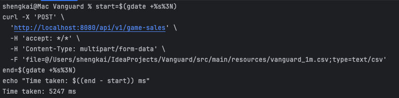
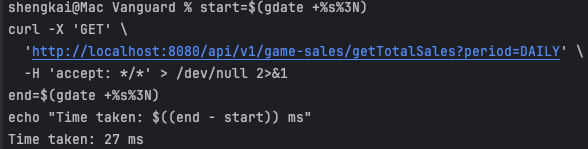
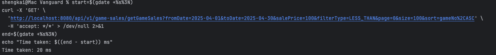

# Vanguard

## Build and Run Instructions

### Prerequisites

- Ensure you have Java 17 or higher installed.
- Install [Maven](https://maven.apache.org/) (version 3.8 or higher).
- Clone the repository:
  ```bash
  git clone https://github.com/Propius/Vanguard.git
  cd Vanguard

### Build

- Build the project using Maven:
  ```bash
  mvn clean install
  ```

### Run

- Run the application using Maven:
  ```bash
  mvn spring-boot:run
  ```
- Remember to run the sql script `combined_sales_summary_view.sql` in your database to create the necessary views.

### Running Test

- Run the tests using Maven:
  ```bash
  mvn test
  ```

### Accessing the Application

http://localhost:8080/swagger-ui/index.html#/

### Accessing RabbitMQ Management Console

http://localhost:15672/

### Screenshots

- /import

  

- /getTotalSales

  

- /getGameSales

  
